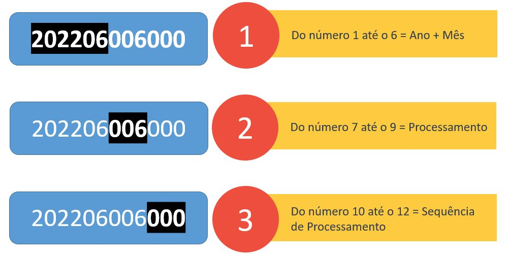
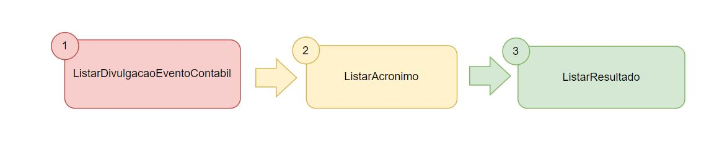
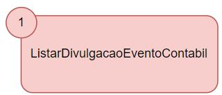
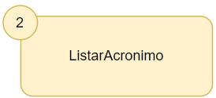
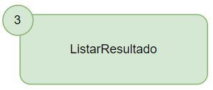

# GUIA ACRONIMO - Consulta de Acrônimos através da Plataforma de Integração
Ao realizar a integração entre sua aplicação e a CCEE através da Plataforma de Integração, o agente pode:

- Listar o resultado da consulta de acrônimos

## Antes de tudo o que é um evento contábil ?

{:height="50px" width="50px"}

Um evento contábil é um código que representa a rodada do cálculo do motor da CCEE (Definição melhorada com o Lassi/Gedra). Ele é composto na sua primeira parte pelo Ano/Mês, números de 1 a 6, depois pelo processamento, números de 7 a 9, e depois pela sequência de processamento, números de 10 a 12, vide exemplo acima.

## O que fazer para consultar os resultados dos acrônimos da DRI disponibilizados pela Plataforma de Integração?

### Siga esta ordem para a chamada de serviços:

 

Para chegar no resultado final de extrair as informações do resultado dos acrônimos através da Plataforma de Integração da CCEE, deve-se seguir esta ordem de chamada dos serviços, primeiro para identificar qual o evento contábil divulgado ao público tem-se interesse através do uso do primeiro serviço. Chamando o segundo serviço, deve-se encontrar o acronimo desejado. Por fim, ao chamar o terceiro serviço, ele retornará dados do resultado do acrônimo escolhido.

--- 
 
### Liste os eventos contábeis divulgados pela CCEE

Utilize o serviço *ListarDivulgacaoEventoContabil* para consultar os eventos contábeis que foram disponibilizados pela CCEE através da Plataforma de Integração.

[Clique aqui](https://documenter.getpostman.com/view/12351215/UzJJucpF#87f02261-4a72-47bf-b1c7-db79bb3bdcab) para ver exemplos de consulta utilizando a ferramenta Postman em seu navegador.
    
Os campos de entrada e saída do serviço podem ser consultados no [manual de utilização](https://www.ccee.org.br/documents/80415/919484/ListarDivulgacaoEventoContabilV2.pdf/e7b35bc2-7b39-f543-0972-ab9af0db9621) desse serviço. 

> Clique no botão abaixo e abra a configuração direto no Postman instalado em seu computador com os serviços da Plataforma de Integração, incluindo o Listar Divulgação Evento Contábil
>
> 

---

### Liste os acrônimos disponibilizados pela CCEE

Utilize o serviço *ListarAcronimo* para consultar acronimos disponíveis através da Plataforma de Integração da CCEE.

[Clique aqui](https://documenter.getpostman.com/view/12351215/UzJJucpF#acea95c9-86a9-4b63-83d6-302a66f80be1) para ver exemplos de consulta utilizando a ferramenta Postman em seu navegador.
    
Os campos de entrada e saída do serviço podem ser consultados no [manual de utilização](https://www.ccee.org.br/documents/80415/919484/ListarAcronimoV2.pdf/08456487-df2f-ea7e-0b3a-8861bb81acf1) desse serviço. 

> Clique no botão abaixo e abra a configuração direto no Postman instalado em seu computador com os serviços da Plataforma de Integração, incluindo o Listar Acronimo
>
> 

---

### Liste os eventos contábeis divulgados pela CCEE

Utilize o serviço *ListarResultado* para consultar os valores/resultados dos acrônimos solicitados através da Plataforma de Integração da CCEE.

[Clique aqui](https://documenter.getpostman.com/view/12351215/UzJJucpF#87f02261-4a72-47bf-b1c7-db79bb3bdcab) para ver exemplos de consulta utilizando a ferramenta Postman em seu navegador.
    
Os campos de entrada e saída do serviço podem ser consultados no [manual de utilização](https://www.ccee.org.br/documents/80415/919484/ListarResultadoV2%20(1).pdf/9ee51a45-74ce-3295-69af-d03f77a992b1) desse serviço. 

> Clique no botão abaixo e abra a configuração direto no Postman instalado em seu computador com os serviços da Plataforma de Integração, incluindo o Listar Resultado
>
> 

---

### Posso enviar mais de um acrônimo na consulta de resultados?

Sim você pode, porém existe a seguinte regra para seguir:

Conforme pontuado pela regra de comercialização, os acrônimos são calculados em dimensões temporais diferentes, dentro de um mesmo evento contábil. Podemos ter acrônimos que variam de uma dimensão horária, representada por **j** na álgebra, perpassando por temporalidades semanais e mensais até anuais. No serviço essas características influenciam a forma como a requisição pode ser solicitada. Dessa forma, temos o seguinte racional:

- Para dimensão horária **(j)**, permite-se consultar **1 (um) acrônimo** por requisição;
- Para dimensões semanais **(r,w)** por patamar, permite-se consultar até **5 (cinco) acrônimos** por requisição;
- Para dimensão mensal **(m)**, permite-se consultar até **20 (vinte) acrônimos** por requisição

**É importante ressaltar que requisições com códigos de acrônimos com dimensões diferentes não serão efetuadas.**

